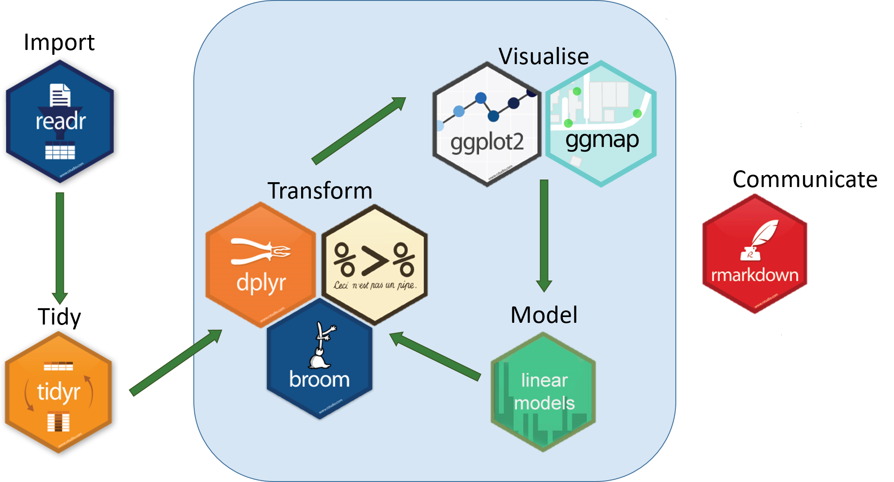

```{r setup, include=FALSE}
options(htmltools.dir.version = FALSE)

library(tidyverse)
library(xaringanthemer)
targets::tar_read(data)
```

--dim-gray: #626262ff;
--dark-slate-blue: #553b91ff;
--cg-blue: #007da1ff;
--tan: #d5ba8cff;
--black: #000000ff;

```{r xaringan-themer, include=FALSE, warning=FALSE}
#style_duo_accent(
#  primary_color = "#d5ba8c",
#  secondary_color = "#554B53",
#)
#source(here::here("presentation", "color_palette_bsl.R"))
```


```{r xaringanExtra, echo=FALSE}
#xaringanExtra::use_xaringan_extra(c("tile_view", #"animate_css", "tachyons", "logo", "use_fit_screen"))
```

name: title_slide
class: no-slidenumber, left, top
background-image: url("logo.png"), url('title_opaque.jpg')
background-size: 7%, cover
background-position: 97% 5%, 0% 

```{asis, echo = FALSE}
image from: https://www.softwareimprovementgroup.com/resources/cicd-best-practices/
```

```{css, echo = FALSE}
t1 {
  font-size: 80px;
  font-weight: bold;
}
t2 { 
  font-size: 60px;
  font-weight: bold;
}
t3 {
  font-size: 40px;
  font-weight: 1000;
}
```

<t1  style="margin-top: 180px; position:absolute; left: 50px">
  <i>
    `r rmarkdown::metadata$subtitle`
  </i>
</12>

<h3 style="position:absolute; top: 600px; left: 1000px"> 
  `r rmarkdown::metadata$date`
</h3>


<t3 style="position:absolute; top: 550px; left: 25px">
  `r icons::fontawesome("globe")` andrewfarina.com &nbsp;
  `r icons::fontawesome("envelope")` andrew.farina@westpoint.edu <br>
  `r icons::fontawesome("github")` github/A-Farina &nbsp;&nbsp;&nbsp;&nbsp;&nbsp;&nbsp; 
  `r icons::fontawesome("twitter")` AndrewFarina01 
</t3>

---
class: inverse, left, top
background-image: url("logo.png")
background-size: 7%
background-position: 97% 5%

<t1 style="position: absolute; margin-top: 200px; left: 50px">
  R Scripts are the key to reproducible research...
</t1>

--

<t2 style="position: absolute; top: 475px; left: 100px; text-align: center">
  ...maybe more like a gateway drug
</t2>

---
class: inverse, left, top
background-image: url("logo.png")
background-size: 7%
background-position: 97% 5%




--


--


---
exclude: FALSE
name: discussion
class: inverse, left, top
background-image: url("logo.png")
background-size: 7%
background-position: 97% 5%

<t2  style="position: absolute; top: 200px; text-align: center"> 
  What are your thoughts at this point? 
</t2>

<center>.footnote[*Disclaimer: All thoughts and opinions shared in this presentation are those of the author and not necessarily the official policy of the Department of Defense, the U.S. Army, or the United States Military Academy* <br><br>
Slides created via the R packages: 
[xaringan](https://github.com/yihui/xaringan), 
[gadenbuie/xaringanthemer](https://github.com/gadenbuie/xaringanthemer), and
[R Markdown](https://rmarkdown.rstudio.com).]
</center>
